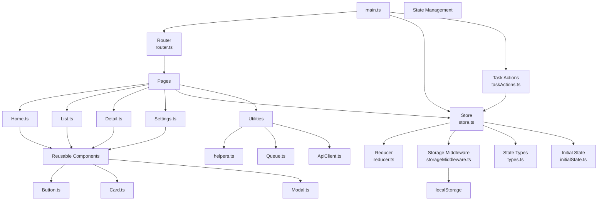

# Architecture

## Overview

The TypeScript Task Manager is a small Single-Page Application (SPA) organized into separate modules for routing, UI rendering, state management, persistence, and utilities.

The main application flow is:

`main.ts` → `Router` → `Pages` → `Components`

State-related operations flow through:

`Pages / Task Actions` → `Store` → `Reducer`

Persistent data flows through:

`Store` → `Storage Middleware` → `localStorage`

## Component and Module Diagram



## Module Responsibilities

### `main.ts`

The application entry point.

Responsibilities:

- Initialize the application.
- Create the state store.
- Register application routes.
- Initialize the router.
- Handle navigation events.
- Load tasks when the application starts.

### Router

The router provides client-side navigation for the SPA.

Supported routes include:

- `/home`
- `/list`
- `/detail/:id`
- `/settings`

It also extracts dynamic route parameters such as the task ID from `/detail/:id`.

### Pages

The page modules are responsible for rendering application screens.

| Module        | Responsibility                         |
| ------------- | -------------------------------------- |
| `Home.ts`     | Renders the home page                  |
| `List.ts`     | Displays and manages the task list     |
| `Detail.ts`   | Displays an individual task            |
| `Settings.ts` | Manages application settings and theme |

### Reusable Components

The application uses reusable UI components to avoid duplicating DOM creation logic.

| Component   | Responsibility                          |
| ----------- | --------------------------------------- |
| `Button.ts` | Creates reusable buttons                |
| `Card.ts`   | Provides reusable card-style containers |
| `Modal.ts`  | Creates reusable modal dialogs          |

These components are designed to be independent of application state.

### State Management

The state layer follows a reducer-based architecture.

#### Store

`store.ts` maintains the current application state and provides:

- `getState()`
- `dispatch()`
- `subscribe()`

#### Reducer

`reducer.ts` receives the current state and an action and returns the next state.

Actions include:

- `ADD_TASK`
- `UPDATE_TASK`
- `DELETE_TASK`
- `TOGGLE_TASK`
- `SET_LOADING`
- `SET_ERROR`
- `SET_THEME`
- `ROUTE_CHANGED`

#### Types

`types.ts` defines the TypeScript types used by the state management system, including:

- `Task`
- `State`
- `Action`
- `Dispatch`
- `Reducer`
- `Store`

### Storage Middleware

`storageMiddleware.ts` handles persistence of application data using `localStorage`.

This keeps persistence logic separate from the reducer and UI components.

### Task Actions

`taskActions.ts` contains task-related actions that may involve asynchronous operations, such as loading tasks.

### Utilities

The `utils` directory contains reusable functionality that is not tied directly to a specific page.

- `helpers.ts` — general helper functions
- `Queue.ts` — generic queue implementation
- `ApiClient.ts` — generic API client

## Data Flow

A typical task update follows this flow:

```text
User Interaction
       ↓
Page Component
       ↓
store.dispatch(action)
       ↓
Reducer
       ↓
New State
       ↓
Store Subscribers
       ↓
UI Re-render
```

For persisted state:

```text
Action
  ↓
Store
  ↓
Reducer
  ↓
Storage Middleware
  ↓
localStorage
```

## Design Principles

The application follows these principles:

1. **Separation of concerns** — routing, UI, state, persistence, and utilities are separated into different modules.
2. **Typed state management** — application state and actions are explicitly typed.
3. **Reusable components** — common UI elements are implemented as reusable components.
4. **Pure reducer logic** — the reducer calculates new state from the previous state and an action.
5. **Centralized state** — shared application state is maintained by the store.
6. **Persistence isolation** — localStorage access is handled by middleware rather than UI components.
7. **Single-page navigation** — client-side routing avoids full-page navigation between application views.
